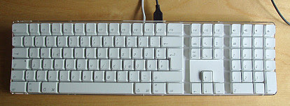
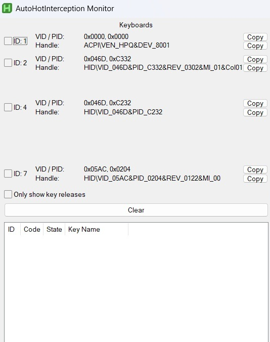

# Mac Remapper

This remaps the Mac 2008 keyboard's Left Option and Left Command keys, to match LWin and LAlt on Windows.



(Image source: [Xah Lee](http://xahlee.info/kbd/apple_keyboard_history.html))

Command serves as super/Windows on Windows and option serves as alt, which is flipped. To fix this, you can use `mac_remapper.ahk`.

# WARNING
Do not unplug and replug more than 10 times, the driver cannot detect the device after that

# Known Issues
The Ctrl-Alt-Del issue has been fixed. Using subscription events instead of a context manager allows the interception to be completed at the kernel level. The only issue is the unplug+replug problem, which is an issue with AHI. Lag should also be removed with this intercept.

# Requirements & Installation
First, install [AutoHotKey](https://www.autohotkey.com/). <br> Then, install the [AutoHotInterception Driver](https://github.com/evilC/AutoHotInterception).

Now, you have to check your hardware ID using `Monitor.ahk` (source: AutoHotInterception Repo).



Pull this repo.

Click on each of the IDs (ONE AT A TIME! Select more than one and it can crash your device) and type on your keyboard until you get signals from the desired keyboard (for me, this was ID7). Note down the VID and PID.

Once you have this, modify `mac_remapper.ahk` and modify these lines:
```
;; Replace these with your device's VID and PID
VID := 0
PID := 0
```
With your VID and PID.

Finally, set `mac_remapper.ahk` to run on startup and you're good to go!

# Special Thanks
- [sameerdash2](https://github.com/sameerdash2) for debugging this README
- [Umair Rizwan](https://github.com/iconsumeplutonium) for debugs + Code cleanup with some PID/VID vagueness
    
    Developer note (for when I read this 5 years from now): this happened due to having to use `GetDeviceID` instead of `GetKeyboardId` 
    (basically tearing apart the AHI function calls and reworking it for an event loop)
